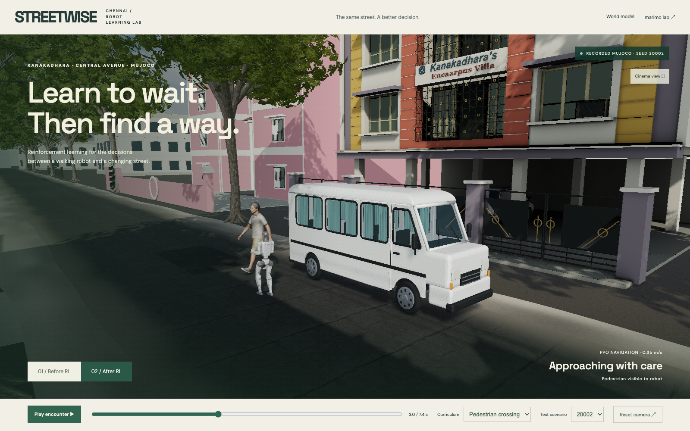

# STREETWISE

**Robots that learn the street before they enter it.**

STREETWISE turns a photo-informed Chennai street into a repeatable robot learning environment. A walking robot encounters an occluded pedestrian, learns a better navigation policy from simulator outcomes, and is evaluated on unseen encounters. The purpose is to find costly navigation mistakes in simulation before deploying a robot.

118-second demo: rendering · [Pitch PDF](artifacts/fork/media/STREETWISE-pitch.pdf) · [Editable slides](artifacts/fork/media/pitch.html) · [Submission copy](docs/fork/submission.md)

## Run the demo

Prerequisites: Node 24+, Python 3.12, Git; CMake and a C compiler for the optional SDK verification. macOS Apple Silicon and Linux training are exercised. No physical robot is required.

```sh
git clone https://github.com/KaushikSiva/g1-street-wise.git
cd g1-street-wise
npm ci
npm run build
npm run preview -- --host 127.0.0.1 --port 5189 --strictPort
```

Open **http://127.0.0.1:5189/?robot=1**. Recorded physics replays, all 64 test scenarios, before/after switching and scrubbing work without API keys. The replay is clearly labeled; pressing play does not run new physics.

For the complete Python training, SDK, Weave service and marimo lab:

```sh
python3.12 scripts/fork/setup.py
# Fill the private .env file if you want W&B and Weave logging.
.venv-fork/bin/python scripts/fork/start.py
```

Stop an already running preview before using the combined launcher. It preserves services already using its ports. Ctrl-C stops the processes it started.

| Surface | Address |
|---|---|
| Robot RL before/after | http://127.0.0.1:5189/?robot=1 |
| Interactive learned world model | http://127.0.0.1:5189/?fork=1 |
| marimo evidence lab | http://127.0.0.1:2718 |
| Experiment health | http://127.0.0.1:8191/health |

## What improved

The pedestrian curriculum trained PPO for 131,072 control steps. Its three options are wait, walk at 0.35 m/s and walk at 0.7 m/s. The official Unitree 12-DoF LSTM policy remains frozen and drives MuJoCo at 50 Hz; navigation chooses commands at 5 Hz and physics steps at 500 Hz.

| 64 held-out encounters | Constant 0.7 m/s | Trained navigation |
|---|---:|---:|
| Completed crossings | 42 | 64 |
| Clearance violations | 22 | 0 |
| Falls | 0 | 0 |
| Mean episode duration | 6.41 s | 7.97 s |

Completion requires passing the crossing by 1 m within 12 seconds without a clearance violation. The pedestrian envelope is a conservative 0.55 m center-distance threshold. Longer average time includes waiting; baseline failures can terminate early. These numbers do not establish physical robot safety.

[W&B experiment and training curves](https://wandb.ai/kaushik-siva88/Unitree%20G1/runs/8upngyv4). Raw results, per-seed outcomes and selected checkpoint are in `artifacts/fork/rl-corridor-v2/`. Validation seeds 10001–10032 select the best checkpoint by return. Test seeds 20001–20064 are evaluated only after selection. Training uses seeds below 9000.

The expanded held-out test completed 64/64 encounters versus 28/64 for constant forward motion. Violations fell from 35 to zero and falls remained zero. The corrected car path keeps the full vehicle body clear of the van. This curriculum was warm-started from a prior navigation checkpoint, then refined for 65,536 additional control steps. A second curriculum adds moving cars and a road-defect keep-out zone, plus left/right velocity options. Its separate [GPU run](https://wandb.ai/kaushik-siva88/Unitree%20G1/runs/aer2e51j) runs on the user's molab RTX PRO 6000 Blackwell. MuJoCo and the frozen gait remain on CPU; PPO uses CUDA. A small MLP does not fully utilize this GPU. The pothole is an avoidance footprint, not physically deformed terrain.

## Reproduce training and evaluation

```sh
# Train, select on validation, then evaluate 64 test seeds and save joint replays.
.venv-fork/bin/python scripts/fork/robot/train.py --steps 131072 --seed 7 --output artifacts/fork/reproduction --wandb
# Expanded curriculum; use --device cpu when CUDA is unavailable.
.venv-fork/bin/python scripts/fork/robot/train.py --hazards --steps 131072 --device cuda --output artifacts/fork/rl-hazards --wandb
.venv-fork/bin/python scripts/fork/robot/evaluate_checkpoint.py artifacts/fork/rl-corridor-v2/best.zip
# The interactive world model has an independent deterministic evaluation.
node --experimental-strip-types scripts/fork/model-check.ts
```

MuJoCo, Torch and platform differences can alter trajectories; the included artifacts identify the measured run. `.env.example` documents optional credentials. Never use a `VITE_` prefix for API keys.

## How the learning loop works

Two complementary experiments share the street visualization. The physical robot experiment learns high-level navigation with PPO from full-joint MuJoCo outcomes. The browser world-model experiment predicts three possible futures with an ensemble of learned dynamics regressors, executes an independently simulated action, adds training encounters and promotes an updated model only after a validation check. Its contacts and dimensions belong to its separate 2D simulator; do not combine those metrics with the MuJoCo test.

The W&B-hosted Qwen model reviews training encounters and chooses a bounded curriculum focus. Weave traces that analysis and the experiment report. Model fitting and evaluation stay deterministic and do not depend on the LLM's claimed performance. No hidden hesitation or test outcomes are passed to the analyst.

## Official SDK and policy

`scripts/fork/robot/sdk_bridge_check.py` sends official SDK2 `LowCmd` packets through DDS domain 42 on loopback. The receiver checks CRC and applies the received PD targets to MuJoCo; `LowState` sends joint feedback back through DDS. The recorded check received 500 commands and 500 feedback messages and walked 4.09 m in ten simulated seconds. No hardware was connected.

```sh
CYCLONEDDS_HOME="$PWD/vendor/cyclonedds/install" .venv-fork/bin/python scripts/fork/robot/sdk_bridge_check.py
```

Setup pins Unitree RL Gym, Unitree SDK2 Python and CycloneDDS revisions. Source/license details are in [asset provenance](docs/fork/asset-provenance.md). The demo loads the official robot URDF and its STL meshes. Human FBX walking motion is an illustrative rig animation; robot joints and actor world positions come from recorded simulator state.

## Submission and limits

[Submission copy and checklist](docs/fork/submission-checklist.md) · [Narration script](docs/fork/demo-script.md)

The existing Chennai map, OSM footprints and photo-informed architecture predate this build. New work comprises the world model, robot simulation, PPO navigation, evaluation, sponsor instrumentation, notebooks and demo. Central Avenue dimensions, vegetation and synthetic encounters are inferred. This is not a surveyed digital twin, a photogrammetry reconstruction, or a real robot trial. The visual scene aims for a realistic presentation; the collision model is deliberately simpler and disclosed.

W&B/Weave and marimo are used. ARIA is not integrated. No claims are made about winning awards, physical deployments or completed participant surveys.
