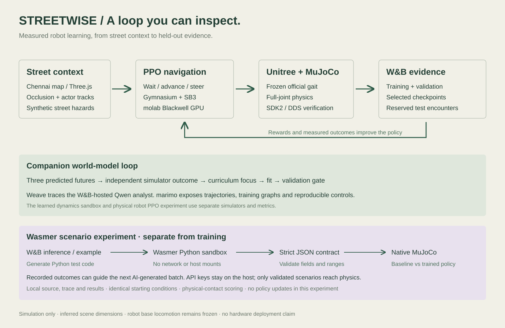

# STREETWISE

We recreated a street in Chennai to see how a robot learns to handle everyday situations: a person stepping out from behind a parked van, a car crossing its path, or rain starting while it is outside.

The robot already knows how to walk. STREETWISE trains it to decide when to wait, where to move and how to reach shelter. It practises in simulation, makes mistakes, and learns from what happens.

You can choose a scenario, watch the robot respond, and compare its behaviour before and after training.

[Try it on Render](https://streetwise-cppv.onrender.com/?robot=1&live=1) · [Open the marimo notebook](https://molab.marimo.io/notebooks/nb_gK678riXiVKWuUAnQjffef)

## Same street. Same pedestrian. A better decision.

Both pictures show the same pedestrian scenario, **20002**, four seconds into a recorded MuJoCo simulation. The camera and walking controller are the same; the navigation decision changes.

| Before: constant forward motion | After: learned navigation |
|---|---|
|  |  |
| The robot bumps into the person. | The robot leaves room for the person and finishes at 7.4 s. |

## How it works — think of learning to cross a street


1. **Observe:** Read the robot’s motion and nearby obstacles from the simulator. The live policies currently use simulator state.
2. **Choose:** A small decision-making model picks “wait,” “slow,” “forward,” or “move sideways.”
3. **Walk:** Unitree's existing walking skill turns that choice into leg movements.
4. **Practise:** MuJoCo simulates what happens. Safe progress earns points; getting too close loses points.
5. **Learn:** PPO makes small changes to the decision model. Then we test it on encounters it did not practise on.

**What is PPO?** Proximal Policy Optimization is a reinforcement-learning method: try actions, measure the reward, and update the policy in controlled steps. Here, we train the robot's navigation decisions. **The pretrained Unitree walking policy stays frozen.**

| Tool | Its job in plain English |
|---|---|
| Unitree policy + MuJoCo | The robot's walking skill and physics practice ground. |
| PPO / Stable-Baselines3 | The coach that improves movement decisions from rewards. |
| W&B | The experiment scorebook: training curves, checkpoints and test results. |
| Weave + W&B-hosted Qwen | A traced analyst for the separate world-model experiment. |
| marimo / molab | An interactive lab notebook and the GPU training workspace. |
| Three.js | The Chennai street you see, replaying recorded robot joint positions. |

The **world-model lab is a separate experiment** that predicts possible futures and learns from new encounters. Its predictions do not currently feed into the robot's PPO policy.

<details>
<summary>Detailed architecture</summary>



</details>

## Run the demo

Prerequisites: Node 24+, Python 3.12, Git; CMake and a C compiler for the optional SDK verification. macOS Apple Silicon and Linux training are exercised. No physical robot is required.

```sh
git clone https://github.com/KaushikSiva/g1-street-wise.git
cd g1-street-wise
npm ci
npm run build
npm run preview -- --host 127.0.0.1 --port 5189 --strictPort
```

Open **`http://127.0.0.1:5189/?robot=1`**. Recorded physics replays, all 64 test scenarios, before/after switching and scrubbing work without API keys. The replay is clearly labeled; pressing play does not run new physics.

For the complete Python training, SDK, Weave service and marimo lab:

```sh
python3.12 scripts/fork/setup.py
# Fill the private .env file if you want W&B and Weave logging.
.venv-fork/bin/python scripts/fork/start.py
```

Stop an already running preview before using the combined launcher. It preserves services already using its ports. Ctrl-C stops the processes it started.

| Surface | Address |
|---|---|
| Robot RL before/after | `http://127.0.0.1:5189/?robot=1` |
| Interactive learned world model | `http://127.0.0.1:5189/?fork=1` |
| marimo evidence lab | `http://127.0.0.1:2718` |
| Experiment health | `http://127.0.0.1:8191/health` |

## Benchmark history

We started with pedestrians, added cars and road defects, then introduced weather and shelter seeking. Each of the original evaluations used 64 test scenarios.

| Original task | Walking straight ahead | Trained navigation |
|---|---:|---:|
| Pedestrian crossing | 42/64 | 64/64 |
| Mixed traffic and road defects | 28/64 | 64/64 |
| Wet roads and reduced visibility | 28/64 | 63/64 |

These were the successes reported by our original scoring. We later found that it missed some physical collisions, so these numbers do not mean every successful run avoided contact. The weather run kept its starting policy; further training did not improve it.

We corrected the collision checks and retrained the traffic policy. Here is how the policies performed on the same 64 traffic scenarios under the corrected scoring:

| Traffic policy | Successful runs |
|---|---:|
| Walking straight ahead | 6/64 |
| Previous trained policy | 41/64 |
| Retrained policy | 60/64 |

The four remaining runs failed. Because we reused these scenarios, this measures improvement on the existing benchmark, rather than performance on a new street.

For rain, we changed the task from continuing along a wet road to finding shelter when rain starts. The trained policy reached shelter in **56/64 scenarios**; eight timed out, with no collisions or falls recorded.

The first camera-based shelter experiment completed **0/16 scenarios**. It is still experimental; the live navigation policies use simulator state.

The original pedestrian policy trained for 131,072 PPO steps. Navigation chooses commands five times per second, the frozen Unitree walking controller runs 50 times per second, and MuJoCo steps the physics 500 times per second. The corrected traffic policy received another 32,768 PPO steps.

Training uses seeds below 9000. Validation seeds 10001–10032 select the checkpoint; the historical test set uses seeds 20001–20064. Saved checkpoints and evaluation results are in `artifacts/fork/rl-corridor-v2/`, `artifacts/fork/rl-hazards-contact-v2/` and `artifacts/fork/rain-shelter-v3/`.

## Rain, fog and an automatic challenge ladder

The weather curriculum mixes pedestrians, crossing cars and marked road defects across dry, wet-road and low-visibility conditions. Rain changes **actual MuJoCo ground-contact friction** (0.40–0.65); fog restricts actor tracking to 2.5–4 m. Browser rain streaks and fog illustrate those recorded conditions. These weather policies use simulator observations; camera-based training is a separate experiment.

The automatic ladder raises difficulty after two consecutive validation checkpoints reach 100% completion with no violations or falls. It reduces friction and tracking range and increases crossing speed and hesitation. Each stage gets disjoint validation and test seeds; test performance never decides promotion. The configured ladder has three harder levels, a per-attempt training budget and up to two attempts per level. Refinement uses smaller learning updates to preserve the existing skill. A stage that is not mastered is reported as needing more practice, rather than being declared solved.

```sh
.venv-fork/bin/python scripts/fork/robot/train.py --weather --resume artifacts/fork/rl-hazards-v2/best.zip --steps 32768 --eval-every 4096 --device cuda --wandb --output artifacts/fork/rl-weather
.venv-fork/bin/python scripts/fork/robot/curriculum.py --initial-run artifacts/fork/rl-weather --max-level 3 --steps-per-level 32768 --device cuda --wandb
```

## Emergency avoidance and multiple shelters

The emergency curriculum adds people lying on the road, debris and accident scenes that appear at different times. These objects have collision geometry in the simulator. It uses 57 simulator-track observations and eight velocity actions, including pure lateral and backward movement. Unknown incidents remain hidden until within tracking range and clear of the parked van. Actual foot contacts and conservative body clearance are measured separately; an observed accident can be handled by a safe stop. Camera recognition is not implemented. This is a separate training curriculum from the traffic and rain policies in the live demo.

In an earlier multiple-shelter experiment, round two improved from **23/64 to 31/64 completed encounters** under its original scoring, comparing its starting and selected policies on the same test seeds; clearance violations fell from **19 to 9**. This expanded task remains unresolved. The rain-onset policy reported above was trained separately.

## Compare two policies, or run live MuJoCo

Open **`http://127.0.0.1:5189/?compare=1`** for synchronized before/after views. Choose one scenario, play or pause both together, and scrub the same simulation time. Completed episodes freeze while the other policy continues.

Recorded mode replays saved joint movements. The Render live demo also lets you choose a scenario and run a fresh MuJoCo comparison. To run fresh physics locally in the native viewer, use:

```sh
# macOS: mjpython is required for the native viewer's main-thread event loop.
.venv-fork/bin/mjpython scripts/fork/robot/viewer.py --policy after --chennai --seed 20002
# Linux: use .venv-fork/bin/python in place of mjpython.
# Run the baseline in another native window if you want both policies open.
.venv-fork/bin/mjpython scripts/fork/robot/viewer.py --policy before --chennai --seed 20002
# Other task and condition choices:
.venv-fork/bin/mjpython scripts/fork/robot/viewer.py --environment weather --policy after --chennai --seed 20001
```

**Space** pauses/resumes; **R** restarts the same encounter. Native windows run independently; the browser comparison provides synchronized controls. Add `--headless` for a fresh physics episode without a window, or `--checkpoint path/to/best.zip` to inspect another compatible policy.

`--chennai` loads the actual nearby street and building mesh geometry exported from the browser scene. Native MuJoCo includes transferred bark, facade and road textures, plus the same skinned FBX person and walking animation. Its lighting and transparency remain different from the browser. Imported scenery is visual only, so it does not change the training collision model. The original pedestrian collision capsule remains active underneath the visual human skin.


## Reproduce training and evaluation

```sh
# Train, select on validation, then evaluate 64 test seeds and save joint replays.
.venv-fork/bin/python scripts/fork/robot/train.py --steps 131072 --seed 7 --output artifacts/fork/reproduction --wandb
# Expanded curriculum; use --device cpu when CUDA is unavailable.
.venv-fork/bin/python scripts/fork/robot/train.py --hazards --steps 131072 --device cuda --output artifacts/fork/rl-hazards --wandb
.venv-fork/bin/python scripts/fork/robot/evaluate_checkpoint.py artifacts/fork/rl-corridor-v2/best.zip
# The interactive world model has an independent deterministic evaluation.
node --experimental-strip-types scripts/fork/model-check.ts
```

MuJoCo, Torch and platform differences can alter trajectories; the included artifacts identify the measured run. `.env.example` documents optional credentials. Never use a `VITE_` prefix for API keys.

## How the learning loop works

Two complementary experiments share the street visualization. The MuJoCo robot experiment learns high-level navigation with PPO from full-joint MuJoCo outcomes. The browser world-model experiment predicts three possible futures with an ensemble of learned dynamics regressors, executes an independently simulated action, adds training encounters and promotes an updated model only after a validation check. Its contacts and dimensions belong to its separate 2D simulator; do not combine those metrics with the MuJoCo test.

The W&B-hosted Qwen model reviews training encounters and chooses a bounded curriculum focus. Weave traces that analysis and the experiment report. Model fitting and evaluation stay deterministic and do not depend on the LLM's claimed performance. No hidden hesitation or test outcomes are passed to the analyst.

## Official SDK and policy

`scripts/fork/robot/sdk_bridge_check.py` sends official SDK2 `LowCmd` packets through DDS domain 42 on loopback. The receiver checks CRC and applies the received PD targets to MuJoCo; `LowState` sends joint feedback back through DDS. The recorded check received 500 commands and 500 feedback messages and walked 4.09 m in ten simulated seconds. No hardware was connected.

```sh
CYCLONEDDS_HOME="$PWD/vendor/cyclonedds/install" .venv-fork/bin/python scripts/fork/robot/sdk_bridge_check.py
```

Setup pins Unitree RL Gym, Unitree SDK2 Python and CycloneDDS revisions. Source and license details are in `docs/fork/asset-provenance.md`. The demo loads the official robot URDF and its STL meshes. Human FBX walking motion is an illustrative rig animation; robot joints and actor world positions come from recorded simulator state.

## Tech stack

Weights & Biases, Weave, marimo, MuJoCo, PPO, Stable-Baselines3, Gymnasium, Python, PyTorch, NumPy, Unitree RL Gym, Unitree SDK2, molab, TypeScript, Three.js, Vite, MapLibre GL, Docker, Render

## Help build the next street

Try a scenario, reproduce a result, or contribute a new street layout. Better perception, additional road conditions and reproducible failure cases are useful next steps. When reporting a problem, include the scenario seed, checkpoint and what you expected the robot to do.

Built by **Kaushik Sivakumar**.
