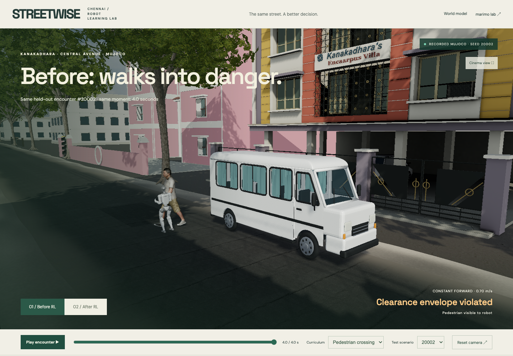
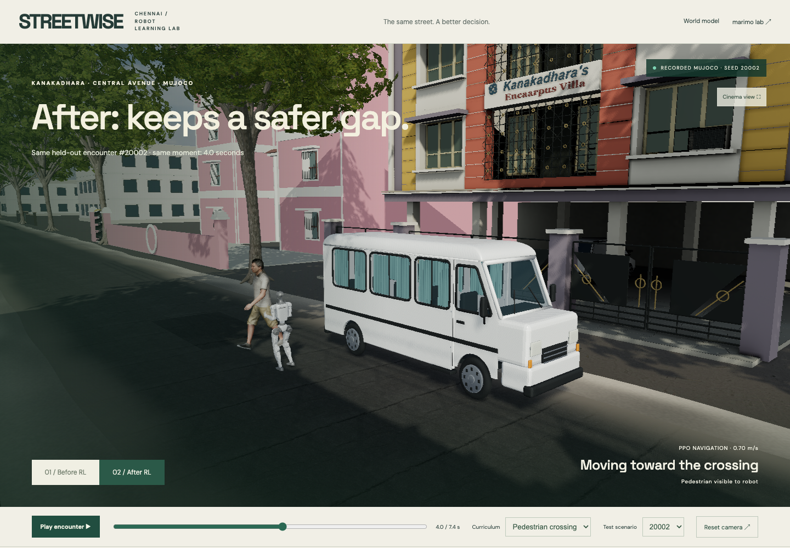
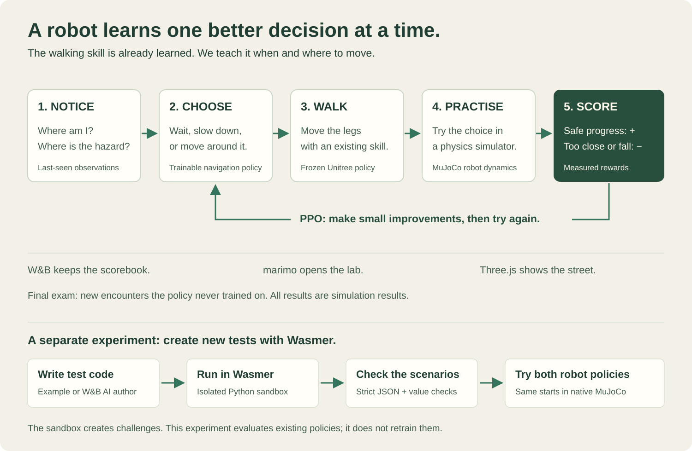
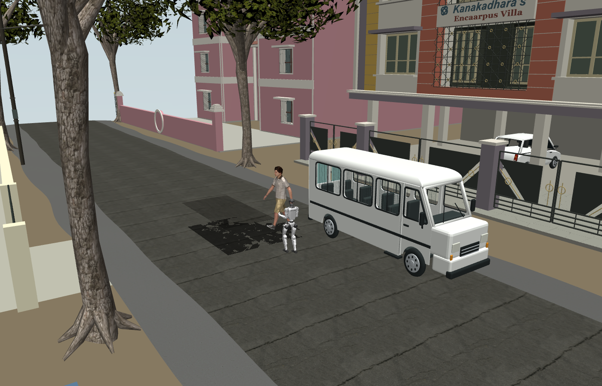
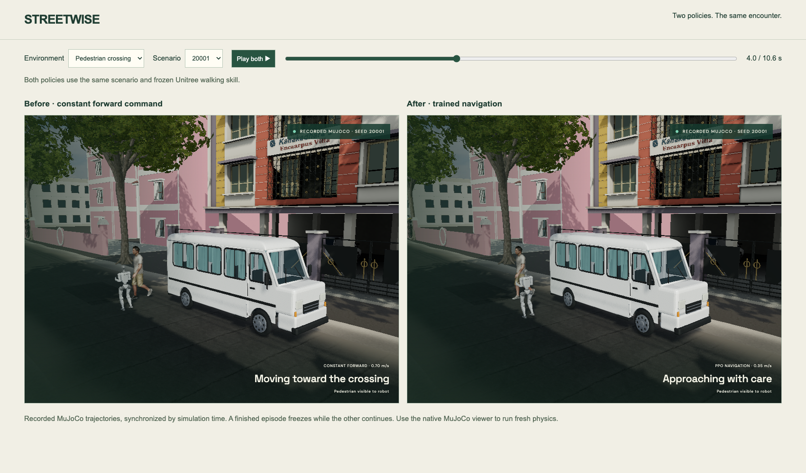

# STREETWISE

**Robots that learn the street before they enter it.**

STREETWISE turns a photo-informed Chennai street into a repeatable robot learning environment. A walking robot encounters an occluded pedestrian, learns a better navigation policy from simulator outcomes, and is evaluated on unseen encounters. The purpose is to find costly navigation mistakes in simulation before deploying a robot.

[118-second demo](../../artifacts/fork/media/STREETWISE-demo.mp4) · [Pitch PDF](../../artifacts/fork/media/STREETWISE-pitch.pdf) · [Editable slides](../../artifacts/fork/media/pitch.html) · [Submission copy](submission.md)

## Same street. Same pedestrian. A better decision.

These are **actual application captures of recorded MuJoCo physics**, not generated before/after pictures. Both show test encounter **20002 at 4.0 seconds**, with the same camera, pedestrian and frozen walking controller.

| Before: constant forward motion | After: learned navigation |
|---|---|
|  |  |
| Clearance violated at 4.0 s. | Clear at 4.0 s; completes at 7.4 s. |

Across **64 unseen mixed-hazard encounters**, completion improved from **28 to 64**, and clearance violations fell from **35 to 0**. These are simulation results, with measured limits explained below.

## How it works — think of learning to cross a street



1. **Notice:** Where am I? Where was the person or car last seen?
2. **Choose:** A small decision-making model picks “wait,” “slow,” “forward,” or “move sideways.”
3. **Walk:** Unitree's existing walking skill turns that choice into leg movements.
4. **Practise:** MuJoCo simulates what happens. Safe progress earns points; getting too close loses points.
5. **Learn:** PPO makes small changes to the decision model. Then we test it on encounters it did not practise on.

**What is PPO?** Proximal Policy Optimization is a reinforcement-learning method: try actions, measure the reward, and update the policy in controlled steps. Here, we train the robot's navigation decisions. **The pretrained Unitree walking policy stays frozen.**

| Tool | Its job in plain English |
|---|---|
| Unitree policy + MuJoCo | The robot's walking skill and physics practice ground. |
| PPO / Stable-Baselines3 | The coach that improves movement decisions from rewards. |
| W&B | The experiment scorebook: training curves, checkpoints and test results. |
| Weave + W&B-hosted Qwen | A traced analyst for the separate world-model experiment. |
| marimo / molab | An interactive lab notebook and the GPU training workspace. |
| Three.js | The Chennai street you see, replaying recorded robot joint positions. |

The **world-model lab is a separate experiment** that predicts possible futures and learns from new encounters. It does not currently feed predictions into the physical robot's PPO policy. [Detailed engineering diagram](../../artifacts/fork/media/architecture.svg).

## Run the demo

Prerequisites: Node 24+, Python 3.12, Git; CMake and a C compiler for the optional SDK verification. macOS Apple Silicon and Linux training are exercised. No physical robot is required.

```sh
git clone https://github.com/KaushikSiva/g1-street-wise.git
cd g1-street-wise
npm ci
npm run build
npm run preview -- --host 127.0.0.1 --port 5189 --strictPort
```

Open **http://127.0.0.1:5189/?robot=1**. Recorded physics replays, all 64 test scenarios, before/after switching and scrubbing work without API keys. The replay is clearly labeled; pressing play does not run new physics.

For the complete Python training, SDK, Weave service and marimo lab:

```sh
python3.12 scripts/fork/setup.py
# Fill the private .env file if you want W&B and Weave logging.
.venv-fork/bin/python scripts/fork/start.py
```

Stop an already running preview before using the combined launcher. It preserves services already using its ports. Ctrl-C stops the processes it started.

| Surface | Address |
|---|---|
| Robot RL before/after | http://127.0.0.1:5189/?robot=1 |
| Interactive learned world model | http://127.0.0.1:5189/?fork=1 |
| marimo evidence lab | http://127.0.0.1:2718 |
| Experiment health | http://127.0.0.1:8191/health |

## What improved

The pedestrian curriculum trained PPO for 131,072 control steps. Its three options are wait, walk at 0.35 m/s and walk at 0.7 m/s. The official Unitree 12-DoF LSTM policy remains frozen and drives MuJoCo at 50 Hz; navigation chooses commands at 5 Hz and physics steps at 500 Hz.

| 64 held-out encounters | Constant 0.7 m/s | Trained navigation |
|---|---:|---:|
| Completed crossings | 42 | 64 |
| Clearance violations | 22 | 0 |
| Falls | 0 | 0 |
| Mean episode duration | 6.41 s | 7.97 s |

Completion requires passing the crossing by 1 m within 12 seconds without a clearance violation. The pedestrian envelope is a conservative 0.55 m center-distance threshold. Longer average time includes waiting; baseline failures can terminate early. These numbers do not establish physical robot safety.

[W&B experiment and training curves](https://wandb.ai/kaushik-siva88/Unitree%20G1/runs/8upngyv4). Raw results, per-seed outcomes and selected checkpoint are in `artifacts/fork/rl-corridor-v2/`. Validation seeds 10001–10032 select the best checkpoint by return. Test seeds 20001–20064 are evaluated only after selection. Training uses seeds below 9000.

The expanded held-out test completed 64/64 encounters versus 28/64 for constant forward motion. Violations fell from 35 to zero and falls remained zero. The corrected car path keeps the full vehicle body clear of the van. This curriculum was warm-started from a prior navigation checkpoint, then refined for 65,536 additional control steps. A second curriculum adds moving cars and a road-defect keep-out zone, plus left/right velocity options. Its separate [GPU run](https://wandb.ai/kaushik-siva88/Unitree%20G1/runs/aer2e51j) runs on the user's molab RTX PRO 6000 Blackwell. MuJoCo and the frozen gait remain on CPU; PPO uses CUDA. A small MLP does not fully utilize this GPU. The pothole is an avoidance footprint, not physically deformed terrain.

## Rain, fog and an automatic challenge ladder

The weather curriculum mixes pedestrians, crossing cars and marked road defects across dry, wet-road and low-visibility conditions. Rain changes **actual MuJoCo ground-contact friction** (0.40–0.65); fog restricts actor tracking to 2.5–4 m. Browser rain streaks and fog illustrate those recorded conditions. Water flow, puddle hydrodynamics and camera-based perception are not simulated.

The first weather run completed **63/64** held-out encounters versus **28/64** for constant forward motion. It retained the starting checkpoint: additional training did **not** improve the selected policy in this run. One rain encounter still violated clearance. [Inspect the measured run](https://wandb.ai/kaushik-siva88/Unitree%20G1/runs/7ohoavvn).

The automatic ladder raises difficulty after two consecutive validation checkpoints reach 100% completion with no violations or falls. It reduces friction and tracking range and increases crossing speed and hesitation. Each stage gets disjoint validation and test seeds; test performance never decides promotion. The configured ladder has three harder levels, a per-attempt training budget and up to two attempts per level. Refinement uses smaller learning updates to preserve the existing skill. A stage that is not mastered is reported as needing more practice, rather than being declared solved.

```sh
.venv-fork/bin/python scripts/fork/robot/train.py --weather --resume artifacts/fork/rl-hazards-v2/best.zip --steps 32768 --eval-every 4096 --device cuda --wandb --output artifacts/fork/rl-weather
.venv-fork/bin/python scripts/fork/robot/curriculum.py --initial-run artifacts/fork/rl-weather --max-level 3 --steps-per-level 32768 --device cuda --wandb
```

## Compare two policies, or run live MuJoCo

Open **http://127.0.0.1:5189/?compare=1** for synchronized before/after views. Choose one scenario, play or pause both together, and scrub the same simulation time. Completed episodes freeze while the other policy continues.

The browser renders saved joint trajectories. To execute a policy against **fresh native MuJoCo physics**, use:

```sh
# macOS: mjpython is required for the native viewer's main-thread event loop.
.venv-fork/bin/mjpython scripts/fork/robot/viewer.py --policy after --chennai --seed 20002
# Linux: use .venv-fork/bin/python in place of mjpython.
# Run the baseline in another native window if you want both policies open.
.venv-fork/bin/mjpython scripts/fork/robot/viewer.py --policy before --chennai --seed 20002
# Other task and condition choices:
.venv-fork/bin/mjpython scripts/fork/robot/viewer.py --environment weather --policy after --chennai --seed 20001
```

**Space** pauses/resumes; **R** restarts the same encounter. Native windows run independently; the browser comparison provides synchronized controls. Add `--headless` for a fresh physics episode without a window, or `--checkpoint path/to/best.zip` to inspect another compatible policy.

`--chennai` loads the actual nearby street and building mesh geometry exported from the browser scene. Native MuJoCo includes transferred bark, facade and road textures, plus the same skinned FBX person and walking animation. Its lighting and transparency remain different from the browser. Imported scenery is visual only, so it does not change the training collision model. The original pedestrian collision capsule remains active underneath the visual human skin.





## Reproduce training and evaluation

```sh
# Train, select on validation, then evaluate 64 test seeds and save joint replays.
.venv-fork/bin/python scripts/fork/robot/train.py --steps 131072 --seed 7 --output artifacts/fork/reproduction --wandb
# Expanded curriculum; use --device cpu when CUDA is unavailable.
.venv-fork/bin/python scripts/fork/robot/train.py --hazards --steps 131072 --device cuda --output artifacts/fork/rl-hazards --wandb
.venv-fork/bin/python scripts/fork/robot/evaluate_checkpoint.py artifacts/fork/rl-corridor-v2/best.zip
# The interactive world model has an independent deterministic evaluation.
node --experimental-strip-types scripts/fork/model-check.ts
```

MuJoCo, Torch and platform differences can alter trajectories; the included artifacts identify the measured run. `.env.example` documents optional credentials. Never use a `VITE_` prefix for API keys.

## How the learning loop works

Two complementary experiments share the street visualization. The physical robot experiment learns high-level navigation with PPO from full-joint MuJoCo outcomes. The browser world-model experiment predicts three possible futures with an ensemble of learned dynamics regressors, executes an independently simulated action, adds training encounters and promotes an updated model only after a validation check. Its contacts and dimensions belong to its separate 2D simulator; do not combine those metrics with the MuJoCo test.

The W&B-hosted Qwen model reviews training encounters and chooses a bounded curriculum focus. Weave traces that analysis and the experiment report. Model fitting and evaluation stay deterministic and do not depend on the LLM's claimed performance. No hidden hesitation or test outcomes are passed to the analyst.

## Official SDK and policy

`scripts/fork/robot/sdk_bridge_check.py` sends official SDK2 `LowCmd` packets through DDS domain 42 on loopback. The receiver checks CRC and applies the received PD targets to MuJoCo; `LowState` sends joint feedback back through DDS. The recorded check received 500 commands and 500 feedback messages and walked 4.09 m in ten simulated seconds. No hardware was connected.

```sh
CYCLONEDDS_HOME="$PWD/vendor/cyclonedds/install" .venv-fork/bin/python scripts/fork/robot/sdk_bridge_check.py
```

Setup pins Unitree RL Gym, Unitree SDK2 Python and CycloneDDS revisions. Source/license details are in [asset provenance](asset-provenance.md). The demo loads the official robot URDF and its STL meshes. Human FBX walking motion is an illustrative rig animation; robot joints and actor world positions come from recorded simulator state.

## Submission and limits

[Submission copy and checklist](submission-checklist.md) · [Narration script](demo-script.md)

The existing Chennai map, OSM footprints and photo-informed architecture predate this build. New work comprises the world model, robot simulation, PPO navigation, evaluation, sponsor instrumentation, notebooks and demo. Central Avenue dimensions, vegetation and synthetic encounters are inferred. This is not a surveyed digital twin, a photogrammetry reconstruction, or a real robot trial. The visual scene aims for a realistic presentation; the collision model is deliberately simpler and disclosed.

W&B/Weave and marimo are used. ARIA is not integrated. No claims are made about winning awards, physical deployments or completed participant surveys.

## Help build the next street

Try an unseen scenario, reproduce a result, or contribute a new measured road condition. Useful contributions include better perception, additional street layouts, stronger locomotion, and reproducible failure cases. Please include the scenario seed, checkpoint and expected/observed behavior when [opening an issue](https://github.com/KaushikSiva/g1-street-wise/issues).

If this is useful for your robotics work, star the repository to follow its progress. Built by **Kaushik Sivakumar**.

## Regenerate the local narration

The demo uses synthetic Fish Audio narration from the public [South Indian Male voice](https://fish.audio/app/text-to-speech/?modelId=324f49797a924f60a3004950b40d0f0e). Set `FISH_AUDIO_API_KEY` in private `.env`, then run `.venv-fork/bin/python scripts/fork/render_fish_narration.py`. The script, timed narration, captions and voice provenance are included. [Fish Audio API documentation](https://docs.fish.audio/api-reference/endpoint/openapi-v1/text-to-speech).
